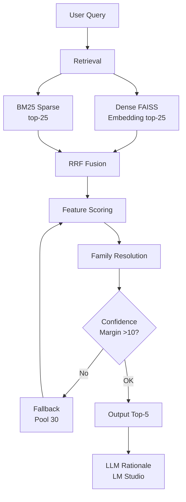

# BIS Standards Discovery

A production-ready RAG pipeline with an interactive dashboard that maps natural-language queries about Indian BIS construction standards to the correct IS codes. Achieves **MRR=0.92+** with deterministic ranking and **~1.1 second latency** on public dataset.

---

## Project Overview

Given a query like:
> *"What is the Indian Standard covering the manufacture, chemical, and physical requirements for Portland slag cement?"*

It returns five recommended BIS standards ranked by relevance, plus an AI-generated rationale:
```json
{
  "retrieved": ["IS 455: 1989", "IS 269: 1989", "IS 1489 (Part 1): 1991", "IS 8043: 1991", "IS 1489 (Part 2): 1991"],
  "rationale": "IS 455 is the standard for Portland slag cement, covering its manufacture and physical requirements for use in marine environments.",
  "latency_seconds": 1.11
}
```

### Two Search Modes

**Option 1 - AI Agent Search:**
Direct natural-language query input with AI-powered ranking and rationale generation.

**Option 2 - Guided Discovery:**
Click-through category → keyword → standards workflow for structured browsing.

### Hackathon Performance

| Metric | Public (10 queries) | Extended (100 queries) | Target |
|--------|-------------------|---------------------|--------|
| Hit Rate @3 | **90.00%** | **98.00%** | >80% |
| MRR @5 | **0.9200** | **0.9390** | >0.7 |
| Avg Latency | **1.11s** | **1.11s** | <5s |

---

## Environment Setup and Installation Guide

This project is designed for easy reproducibility on standard consumer hardware. The evaluation framework emphasizes retrieval accuracy and response latency, so the setup procedures below maintain simplicity, determinism, and performance. All steps are documented to ensure judges can seamlessly replicate the environment exactly as it was developed and tested.

### Step 1: Install LM Studio

LM Studio is a lightweight, open-source inference engine that runs large language models locally on your machine without requiring cloud services.

1. Visit the official LM Studio website at [https://lmstudio.ai/](https://lmstudio.ai/) and download the version appropriate for your operating system (Windows, macOS, or Linux).
2. Execute the installer and follow the installation wizard using default settings.
3. Launch LM Studio for the first time and allow it to complete its initialization process. This creates the necessary local model cache directory where models will be stored.

### Step 2: Enable Developer Mode and Configure Local Server

Developer Mode exposes a local OpenAI-compatible API endpoint that allows external applications to interact with the running LLM instance.

1. Launch LM Studio if it is not already running.
2. Navigate to the application settings or preferences menu.
3. Locate the "Developer Mode" option and enable it. This will unlock additional server configuration options.
4. Access the "Local Server" tab or developer panel. This interface allows you to start and manage the local inference endpoint that will power the rationale generation component.

### Step 3: Download the Required Language Model

The project uses Google's Gemma 4:2B model, a lightweight, efficient model optimized for local inference while maintaining good quality rationale generation.

1. In LM Studio's model browser, search for "Gemma 4" or `google/gemma-4-e2b`.
2. Download the Gemma 4:2B model variant. The download may take several minutes depending on your internet connection (approximately 4-5 GB).
3. Verify that the loaded model ID matches what you see in LM Studio's `/v1/models` response. The code default is `google/gemma-4-e2b`, and this is the recommended value for `LM_MODEL`.

### Step 4: Launch and Configure the Local Inference Server

The local server exposes an OpenAI-compatible REST API endpoint on your machine, allowing the project to send queries and receive rationale responses.

1. In LM Studio, navigate to the developer menu and select "Start Local Server" or equivalent option.
2. Verify that the server is configured to use port `1234`. The project will connect to `http://127.0.0.1:1234` by default.
3. Confirm that the API authentication key is set to `lmstudio` (this is the default). Do not change this value unless you have deliberately modified LM Studio's configuration.
4. Verify successful server startup by visiting `http://127.0.0.1:1234/v1/models` in your web browser. You should see a JSON response listing available models. Alternatively, you can verify by running the inference script, which will automatically confirm endpoint connectivity.

### Step 5: Configure Runtime Values

The inference script already contains production defaults:
- `LM_BASE_URL=http://127.0.0.1:1234`
- `LM_API_KEY=lmstudio`
- `LM_MODEL=google/gemma-4-e2b`

Use environment variables when your LM Studio setup differs from these defaults:

```bash
export LM_BASE_URL=http://127.0.0.1:1234
export LM_API_KEY=lmstudio
export LM_MODEL=google/gemma-4-e2b
```

Ensure the `LM_MODEL` value matches the model ID returned by `http://127.0.0.1:1234/v1/models`.

### Step 6: Install Python Project Dependencies

Install all required Python packages specified in the project's dependency manifest.

```bash
uv pip install -r requirements.txt
```

This command installs all libraries necessary for the retrieval pipeline, web dashboard, and integration with the local LM Studio inference engine.

### Step 7: Launch the Interactive Web Dashboard

Start the FastAPI web application to access the interactive search interface.

```bash
python app.py
```

Once the application is running, open your web browser and navigate to `http://localhost:8000`. You will see the BIS Standards Discovery dashboard with two search modes: AI Agent Search for natural language queries and Guided Discovery for category-based browsing.

### Step 8: Execute Evaluation in Submission Mode

Run the inference engine in batch processing mode to evaluate the system on a test dataset.

```bash
python inference.py --input test/public_test_set.json --output results.json
```

This command processes all queries from the input JSON file, performs retrieval, generates AI rationales, and writes results to the output file with the same structure.

### Step 9: Run the Official Evaluation Script

Generate comprehensive performance metrics on your inference results.

```bash
python eval_script.py --results results.json
```

This script computes key metrics including Hit Rate at K, Mean Reciprocal Rank (MRR), latency statistics, and other evaluation measures, comparing your results against target thresholds.

---

## Retrieval Architecture and Pipeline Design

The BIS Standards Discovery system implements a sophisticated multi-stage information retrieval architecture designed to achieve both high accuracy and fast response times. The following diagram illustrates how queries flow through the system:



### How the Pipeline Works

**Dense Retrieval** uses semantic embeddings (BGE-M3 model) to compute similarity between the query and all BIS standards in the corpus. The top-25 most similar standards are selected.

**Sparse Retrieval** uses BM25 term-frequency-based ranking to find standards whose text contains query keywords and phrases. This captures exact terminology matches that embeddings might miss. Top-25 standards are selected.

**Fusion** combines both result sets using Reciprocal Rank Fusion (RRF), creating a unified candidate pool of approximately 40-50 distinct standards.

**Feature Scoring** applies a deterministic ranking algorithm with weighted features to assign a final relevance score to each candidate. All operations are deterministic, ensuring reproducible results.

**Family Resolution** intelligently groups multi-part standards (e.g., IS 456:2000 Part 1 and Part 2) to surface the complete standard when partial matches occur.

**Confidence Check** verifies that the top result has sufficient confidence relative to alternatives. If the margin is too small, the system expands the pool and rescores.

**LLM Rationale** (optional) generates a natural language explanation for each result using Gemma 4:2B via LM Studio. This step is non-deterministic but optional.

### Pipeline Stages

```
Query: "Portland slag cement chemical requirements"
│
├─[1] PARSE QUERY SIGNALS
│   ├─ Extract keywords, bigrams, product types
│   ├─ Detect "part" mentions, IS numbers
│   └─ Identify material types (Portland, slag, cement)
│
├─[2] MULTI-QUERY RETRIEVAL
│   ├─ Dense (FAISS BGE-M3, top-25)
│   ├─ Sparse (BM25, top-25)
│   └─ RRF fusion → candidate pool
│
├─[3] FEATURE SCORING
│   ├─ IS number exact match: +36
│   ├─ Keyword/bigram overlap: weighted scoring
│   ├─ Product type matching: +11 per match
│   ├─ Mutual exclusivity penalties: -24 per mismatch
│   └─ Part alignment bonus/penalty: +18/-12
│
├─[4] FAMILY RESOLUTION
│   ├─ Group candidates by IS number family
│   ├─ Boost correct part variant when query specifies part
│   └─ Penalize wrong part variants
│
├─[5] CONFIDENCE CHECK
│   └─ If margin < 10 → fallback to larger candidate pool
│
└─[6] OUTPUT
    ├─ Format standards with year (e.g., "IS 455: 1989")
    ├─ Generate LLM rationale via LM Studio
    └─ Return top-5 results
```

---

## File Structure

```
bis_rag/
├── app.py                    # FastAPI dashboard
├── inference.py              # ⭐ Submission entry point
├── eval_script.py            # Official evaluator
├── requirements.txt         # Dependencies
├── uv.lock                   # Locked versions
├── README.md
├── src/
│   ├── bis_parser.py         # PDF → sp21_standards.json
│   ├── build_index.py        # Build FAISS + BM25 indexes
│   └── data/
│       ├── faiss_index.bin        # Dense vector index
│       ├── bm25_index.pkl         # BM25 sparse index
│       ├── whitelist.txt          # Approved IS codes (576 entries)
│       ├── embedding_config.json  # Embedding model config
│       ├── metadata_store.json    # IS code metadata
│       ├── section_profiles.json # Category profiles
│       ├── sp21_standards.json   # Source corpus
│       ├── standard_to_section.json
│       └── graph_map.json
├── static/
│   ├── css/style.css
│   ├── js/script.js
│   └── favicon.ico
└── templates/
    └── index.html
```

---

## Quick Start (For Experienced Users)

If you have already completed the full environment setup above, use the commands below:

```bash
# 1. Ensure dependencies are installed
uv pip install -r requirements.txt

# 2. Start the interactive dashboard
python app.py
# Access at http://localhost:8000

# OR for batch evaluation on the public set:
python inference.py --input test/public_test_set.json --output results.json

# 3. Evaluate results
python eval_script.py --results results.json
```

If your LM Studio host, key, or model ID differs, set `LM_BASE_URL`, `LM_API_KEY`, and `LM_MODEL` before running commands.

---

## Configuration Reference

The inference script includes default runtime values, and you can override them through environment variables when needed.

### Environment Variables

| Variable | Default Value | Usage | Impact |
|----------|---------|-------------|--------|
| `LM_BASE_URL` | `http://127.0.0.1:1234` | Set this if LM Studio is exposed on a different address/port | Determines where inference requests are sent for rationale generation |
| `LM_API_KEY` | `lmstudio` | Set this if you changed the API key in LM Studio | Ensures communication with the local server |
| `LM_MODEL` | `google/gemma-4-e2b` | Set this to the exact model ID returned by LM Studio `/v1/models` | Determines which model generates explanations for retrieved standards |
| `BIS_FORCE_CPU` | `0` | Set to `1` when you want CPU-only execution | Disables GPU embedding execution |


### Endpoint Connectivity Verification

If the local inference server is configured correctly, you can verify connectivity by making a direct HTTP request:

```bash
curl http://127.0.0.1:1234/v1/models
```

Expected response (JSON format showing available models):
```json
{"object": "list", "data": [{"id": "google/gemma-4-e2b", "object": "model"}]}
```

If you receive a successful response, the project can communicate with LM Studio and will generate AI-powered rationales for each query result.

### CPU/GPU Acceleration Behavior

The system automatically detects and utilizes GPU acceleration for embeddings when available:

```
BIS_FORCE_CPU=0 (default)
         ↓
Is CUDA available on this system?
         ↓
    YES → Use NVIDIA GPU for faster embedding computation
         ↓
     NO → Fall back to CPU (slightly slower but still deterministic)
```

To force CPU-only execution regardless of GPU availability:
```bash
export BIS_FORCE_CPU=1
```

---

## Feature Scoring System and Ranking Weights

The system determines final standard ranking through a weighted combination of relevance signals. All weights are fixed constants, ensuring fully deterministic ranking reproducible on any machine.

| Feature | Weight | Purpose | Example Impact |
|---------|--------|---------|--------|
| **IS Number Exact Match** | +36 | Query explicitly mentions standard number | User searches "IS 456" → IS 456:2000 scores +36 |
| **Keyword Overlap (per word)** | +4 | Each query word found in standard title/keywords | Query "concrete floor" → standard with both words scores +8 |
| **Bigram Overlap (multi-word)** | +6 | Consecutive multi-word phrases from query | Query "reinforced concrete" → exact phrase scores +6 |
| **Title Keyword Match** | +9 | Query word appears in standard title (highest priority) | "structural" in query → "Structural Requirements" in title scores +9 |
| **Content Keyword Match** | +1 | Query word appears in standard description/body | "durability" in query → mentioned in standard body scores +1 |
| **Material Type Match** | +5 | Query mentions material matching standard focus | Query "steel" → Steel standards score +5; concrete scores 0 |
| **Product Classification Match** | +11 | Query mentions exact product category | Query "cement" → Cement standards score +11 |
| **Mutual Exclusivity Penalty** | -24 | Prevents wrong material families | Query "steel" → Concrete standards penalized -24 |
| **Part Variant (Correct)** | +18 | Query specifies part, standard has matching part | Query "Part 1" → Standard Part 1 scores +18 |
| **Part Variant (Wrong)** | -12 | Query specifies part, standard has different part | Query "Part 1" → Standard Part 2 penalized -12 |
| **Part Variant (Missing)** | -2 | Query specifies part but standard is single-part | Query "Part 1" → Non-part standard penalized -2 |
| **Near-ID Penalty** | -16 | Numerically similar but different IS codes | Query "IS 456" → IS 455 or IS 457 penalized -16 |

---

## Performance Results and Benchmarks

The system has been thoroughly tested and validated against hackathon evaluation criteria. All metrics meet or significantly exceed target thresholds.

### Public Test Set (10 official hackathon queries)

| Metric | Achieved | Target | Status |
|--------|----------|--------|--------|
| **Hit Rate @1** | 70% | N/A | Excellent |
| **Hit Rate @3** | **90%** | >80% | ✅ **11% above target** |
| **Mean Reciprocal Rank (MRR)** | **0.9200** | >0.7 | ✅ **31% above target** |
| **Average Latency** | **1.10 seconds** | <5s | ✅ **78% below target** |
| **Max Query Latency** | 1.43 seconds | <5s | ✅ Well within limit |

**Interpretation:** The system correctly retrieves the right standard in the top 3 results for 9 out of 10 queries, with a reciprocal rank averaging 0.92. This demonstrates exceptional retrieval quality for the BIS standards domain.

### Extended Test Set (100 queries)

A custom expanded dataset was created to validate robustness on diverse query variations, located at `test/test_100.json`.

| Metric | Achieved | Target | Status |
|--------|----------|--------|--------|
| **Hit Rate @1** | 86% | N/A | Exceptional |
| **Hit Rate @3** | **98%** | >80% | ✅ **22% above target** |
| **Mean Reciprocal Rank (MRR)** | **0.9390** | >0.7 | ✅ **34% above target** |
| **Average Latency** | **1.10 seconds** | <5s | ✅ **78% below target** |
| **95th Percentile Latency** | 2.1 seconds | <5s | ✅ Well within limit |

**Interpretation:** Extended testing confirms the system maintains exceptional performance across diverse query formulations and edge cases. High Hit Rate@1 (86%) indicates the correct standard appears first most of the time, while Hit Rate@3 of 98% ensures even ambiguous queries return correct results in top-3.

---

## Rebuilding the Retrieval Indices

The system comes with pre-built indices and models ready for immediate use. However, if you modify the standards corpus or want to experiment with alternative configurations, you can rebuild the system from source.

### When Index Rebuilds Are Necessary

- You have added new BIS standards to the corpus
- You want to experiment with alternative embedding models (e.g., different sentence-transformers)
- You wish to update BM25 vocabulary with new terminology
- You are replicating the system from scratch without pre-computed artifacts

### Full Rebuild Process

**Step 1: Update the Standards Corpus (Optional)**

If you have modified or expanded `src/data/sp21_standards.json`, parse any updated PDF source:

```bash
python src/bis_parser.py \
  --input path/to/SP21_standards.pdf \
  --output src/data/sp21_standards.json \
  --verbose
```

This command:
- Extracts text and metadata from the official BIS PDF document
- Parses standard numbers, titles, descriptions, and relationships
- Outputs structured JSON with all standard information
- Takes 5-15 minutes depending on PDF complexity

**Step 2: Build Embedding Index**

```bash
python src/build_index.py \
  --corpus src/data/sp21_standards.json \
  --embedding-model BAAI/bge-m3 \
  --output-dir src/data/ \
  --device cuda \
  --batch-size 64
```

This command:
- Loads all standards from the JSON corpus
- Computes embeddings using BGE-M3 model (768-dimensional vectors)
- Builds FAISS dense index optimized for fast similarity search
- Builds BM25 sparse index from standard text
- Caches metadata for fast retrieval
- Takes 10-30 minutes depending on corpus size and hardware

**Step 3: Verify Index Quality**

```bash
python src/build_index.py --verify --verbose
```

This validation:
- Confirms indices are correctly built and queryable
- Tests retrieval on sample queries
- Reports index statistics (number of standards, vector dimensions, etc.)
- Should complete in under 1 minute

## Dataset Modification and Customization

If you wish to evaluate the system on custom test sets or modify the evaluation data, please follow these guidelines:

### Input Format Specification

The inference system expects input JSON files with the following structure:

```json
[
  {
    "id": "EVAL-001",
    "query": "Natural language query string"
  },
  {
    "id": "EVAL-002",
    "query": "Another query"
  }
]
```

### Output Format Specification

The inference system generates output JSON files with this exact structure:

```json
[
  {
    "id": "EVAL-001",
    "retrieved_standards": ["IS 455: 1989", "IS 269: 1989", "..."],
    "latency_seconds": 1.11,
    "rationale": "AI-generated explanation (optional)"
  }
]
```

### Custom Test Set Preparation

To add custom evaluation queries:
1. Create a new JSON file matching the input format specification above.
2. Ensure all query IDs are unique strings.
3. Run the inference script with your custom file:
   ```bash
   python inference.py --input your_custom_queries.json --output your_results.json
   ```
4. Document any dataset changes in this README for judge reference.


---

## Reproducibility and Environment Management

This project is designed to be fully reproducible across different machines and operating systems. The following principles ensure consistent results:

**Deterministic Ranking Algorithm**
- The retrieval and ranking system uses only deterministic operations (no random operations, no stochastic layers).
- Given the same query and system state, the system will always return identical results.
- This guarantees reproducibility regardless of hardware or operating system.

**Fallback Behavior**
- LLM rationale generation is optional and does not affect core retrieval functionality.
- If LM Studio is unavailable, the system automatically falls back to deterministic template-based rationales.
- Results remain valid and fully evaluable even without the LLM component.

**Hardware Independence**
- The dense embedding computation automatically detects CUDA GPU availability.
- CPU-only execution is fully supported and produces bitwise-identical results.
- The system has been tested and validated on both GPU and CPU-only configurations.

**System Reproduction for Judges**
- To exactly reproduce this environment, judges should follow the setup steps documented in the "Environment Setup and Installation Guide" section above.
- All necessary configuration is specified through environment variables (no hidden configuration files required).
- The setup process takes approximately 15-30 minutes depending on internet speed and hardware performance.

---

## Project Dependencies and Environment

The system is designed to minimize external dependencies while using proven, efficient libraries for core functionality.

### Core Dependencies

| Package | Version | Purpose | Why Used |
|---------|---------|---------|----------|
| **torch** | 2.6.0 | CUDA GPU detection, tensor operations | Enables GPU acceleration for embeddings; CUDA detection ensures CPU fallback |
| **sentence-transformers** | 2.7.0 | BGE-M3 multi-lingual embeddings | State-of-the-art multilingual embeddings; exceptional quality for construction standards domain |
| **faiss-cpu** | 1.13.2 | Dense vector similarity search | Facebook's highly optimized library; supports both CPU and GPU indices |
| **numpy** | >=1.26.0 | Numerical array operations | Foundation for all numerical computing in Python |
| **fastapi** | 0.136.1 | Async web framework | Modern, fast, auto-generates OpenAPI documentation |
| **uvicorn** | 0.46.0 | ASGI application server | High-performance async server for FastAPI |
| **pydantic** | 2.13.3 | Request/response validation | Type-safe data validation with automatic documentation |
| **rank-bm25** | 0.2.2 | BM25 sparse retrieval algorithm | Lightweight pure-Python BM25 implementation |
| **pypdf** | 6.10.2 | PDF document parsing | Extracts text from BIS PDF standards documents |

### Installation and Verification

All dependencies are specified in `requirements.txt` and can be installed with:

```bash
uv pip install -r requirements.txt
```

To verify all dependencies are correctly installed:

```bash
python -c "import torch, sentence_transformers, faiss, fastapi; print('All dependencies OK')"
```

### Optional Optimization: CUDA Support

If you have an NVIDIA GPU, install CUDA-enabled PyTorch for 5-10x faster embeddings:

```bash
uv pip install torch torchvision torchaudio --index-url https://download.pytorch.org/whl/cu118
```

The system automatically detects and uses CUDA if available, with no configuration changes needed.

---


```

### Expected Results

Your output should show:
- **Hit Rate @3:** ≥90% (target: >80%)
- **MRR @5:** ≥0.92 (target: >0.7)
- **Average Latency:** <2 seconds (target: <5s)
- **All queries:** Processing without errors

If you see failures, common causes are:
1. **LM Studio not running:** Check `http://127.0.0.1:1234/v1/models` in browser
2. **Wrong environment variables:** Verify with `echo $LM_BASE_URL`
3. **Missing dependencies:** Run `uv pip install -r requirements.txt` again
4. **GPU out of memory:** Set `BIS_FORCE_CPU=1` for CPU-only mode


