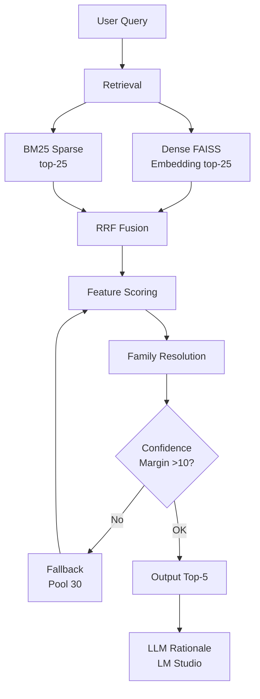

# BIS Standards Discovery

A production-ready RAG pipeline with an interactive dashboard that maps natural-language queries about Indian BIS construction standards to the correct IS codes. Achieves **MRR=0.92+** with deterministic ranking and **~1.1 second latency** on public dataset.

---

## Project Overview

Given a query like:
> *"What is the Indian Standard covering the manufacture, chemical, and physical requirements for Portland slag cement?"*

It returns five recommended BIS standards ranked by relevance, plus an AI-generated rationale:
```json
{
  "retrieved": ["IS 455: 1989", "IS 269: 1989", "IS 1489 (Part 1): 1991", "IS 8043: 1991", "IS 1489 (Part 2): 1991"],
  "rationale": "IS 455 is the standard for Portland slag cement, covering its manufacture and physical requirements for use in marine environments.",
  "latency_seconds": 1.11
}
```

### Two Search Modes

**Option 1 - AI Agent Search:**
Direct natural-language query input with AI-powered ranking and rationale generation.

**Option 2 - Guided Discovery:**
Click-through category → keyword → standards workflow for structured browsing.

### Hackathon Performance

| Metric | Public (10 queries) | Extended (100 queries) | Target |
|--------|-------------------|---------------------|--------|
| Hit Rate @3 | **90.00%** | **98.00%** | >80% |
| MRR @5 | **0.9200** | **0.9390** | >0.7 |
| Avg Latency | **1.11s** | **1.11s** | <5s |

---

## Setup

This project is designed to be easy  to reproduce on a standard consumer machine. The evaluation emphasizes retrieval quality and latency, so the setup below keeps the local inference stack simple, deterministic, and fast.

### 1. Install LM Studio

1. Download LM Studio from the official LM Studio site(https://lmstudio.ai/).
2. Install it with the default options.
3. Launch LM Studio once so it can finish initial setup and create its local model cache.

### 2. Enable Developer Mode

1. Open LM Studio.
2. Go to the settings or developer area and enable Developer Mode if it is not already enabled.
3. Open the Local Server or developer server panel so you can expose a compatible endpoint.

### 3. Download the Model

1. Search for the Gemma 4 2B model in LM Studio.
2. Download the model used by this project: Gemma 4:2B.
3. If LM Studio shows the repository-style model name, use `google/gemma-4-e2b` in the environment variable.

### 4. Start the Local Endpoint

1. In LM Studio go to developer menu and start the local server.
2. Use port `1234` so the project can connect to `http://127.0.0.1:1234`.
3. Keep the API key set to `lmstudio` unless you deliberately changed it in LM Studio.
4. Verify the server by opening `http://127.0.0.1:1234/v1/models` in a browser or by running the inference script once.

### 5. Set the Environment Variables

Set these before running the app or submission script:

```bash
LM_BASE_URL=http://127.0.0.1:1234
LM_API_KEY=lmstudio
LM_MODEL=gemma4:e:2b
```

If your LM Studio installation exposes the model under the repository name, use this instead:

```bash
LM_MODEL=google/gemma-4-e2b
```

### 6. Install Project Dependencies

```bash
uv pip install -r requirements.txt
```

### 7. Run the Project Locally

```bash
python app.py
```

Open `http://localhost:8000` in your browser.

### 8. Run Submission Mode

```bash
python inference.py --input guidelines/public_test_set.json --output results.json
```

### 9. Evaluate the Output

```bash
python eval_script.py --results results.json
```

### 10. What to Reproduce

Keep the README and setup script aligned so judges can reproduce the environment once per team:

1. The exact model name used in `LM_MODEL`.
2. The local endpoint URL and port.
3. Any dataset changes made before evaluation.
4. The command used to run inference.
5. The command used to run evaluation.

---

## Architecture



### Pipeline Stages

```
Query: "Portland slag cement chemical requirements"
│
├─[1] PARSE QUERY SIGNALS
│   ├─ Extract keywords, bigrams, product types
│   ├─ Detect "part" mentions, IS numbers
│   └─ Identify material types (Portland, slag, cement)
│
├─[2] MULTI-QUERY RETRIEVAL
│   ├─ Dense (FAISS BGE-M3, top-25)
│   ├─ Sparse (BM25, top-25)
│   └─ RRF fusion → candidate pool
│
├─[3] FEATURE SCORING
│   ├─ IS number exact match: +36
│   ├─ Keyword/bigram overlap: weighted scoring
│   ├─ Product type matching: +11 per match
│   ├─ Mutual exclusivity penalties: -24 per mismatch
│   └─ Part alignment bonus/penalty: +18/-12
│
├─[4] FAMILY RESOLUTION
│   ├─ Group candidates by IS number family
│   ├─ Boost correct part variant when query specifies part
│   └─ Penalize wrong part variants
│
├─[5] CONFIDENCE CHECK
│   └─ If margin < 10 → fallback to larger candidate pool
│
└─[6] OUTPUT
    ├─ Format standards with year (e.g., "IS 455: 1989")
    ├─ Generate LLM rationale via LM Studio
    └─ Return top-5 results
```

---

## File Structure

```
bis_rag/
├── app.py                    # FastAPI dashboard
├── inference.py              # ⭐ Submission entry point
├── eval_script.py            # Official evaluator
├── requirements.txt         # Dependencies
├── uv.lock                   # Locked versions
├── README.md
├── src/
│   ├── bis_parser.py         # PDF → sp21_standards.json
│   ├── build_index.py        # Build FAISS + BM25 indexes
│   └── data/
│       ├── faiss_index.bin        # Dense vector index
│       ├── bm25_index.pkl         # BM25 sparse index
│       ├── whitelist.txt          # Approved IS codes (576 entries)
│       ├── embedding_config.json  # Embedding model config
│       ├── metadata_store.json    # IS code metadata
│       ├── section_profiles.json # Category profiles
│       ├── sp21_standards.json   # Source corpus
│       ├── standard_to_section.json
│       └── graph_map.json
├── static/
│   ├── css/style.css
│   ├── js/script.js
│   └── favicon.ico
└── templates/
    └── index.html
```

---

## Quick Start

### 1. Install Dependencies

```bash
uv pip install -r requirements.txt
```

### 2. Start LM Studio (Default - for LLM rationale)

```bash
# Ensure LM Studio is running at http://127.0.0.1:1234
LM_BASE_URL=http://127.0.0.1:1234 LM_MODEL=gemma4:e:2b
```

**Option B - LM Studio local server:**
```bash
# Start the LM Studio local server on port 1234
# Then run with:
# LM_BASE_URL=http://127.0.0.1:1234 LM_API_KEY=lmstudio LM_MODEL=gemma4:e:2b python inference.py --input ...
```

### 3. Run Dashboard

```bash
python app.py
# Open http://localhost:8000
```

### 4. Run Inference (Submission Mode)

```bash
python inference.py \
  --input guidelines/public_test_set.json \
  --output results.json
```

### 5. Evaluate

```bash
python eval_script.py --results results.json
```

---

## Environment Variables

| Variable | Default | Description |
|----------|---------|-------------|
| `LM_BASE_URL` | `http://127.0.0.1:1234` | LM Studio endpoint (default) |
| `LM_API_KEY` | `lmstudio` | API key |
| `LM_MODEL` | `gemma4:e:2b` | Model name (recommended: gemma4:e:2b) |
| `BIS_FORCE_CPU` | `0` | Set to `1` to force CPU |

### Local Endpoint Check

If the endpoint is configured correctly, this should return the available models:

```bash
curl http://127.0.0.1:1234/v1/models
```

If you get a response, the project can use LM Studio for rationale generation.

### CPU/CUDA Behavior

```
BIS_FORCE_CPU=1  →  Force CPU (overrides CUDA)
         ↓
torch.cuda.is_available()?
         ↓
    Yes → Use CUDA for embeddings
         ↓
     No → CPU fallback
```

---

## Feature Scoring Weights

| Feature | Weight | Purpose |
|---------|--------|---------|
| IS number exact match | +36 | Direct mention in query |
| Keyword overlap | +4/match | Semantic matching |
| Bigram overlap | +6/bigram | Phrase matching |
| Title keyword overlap | +9/match | Title-specific term matching |
| Content keyword overlap | +1/match | Body text term matching |
| Material overlap | +5/match | Material type matching |
| Product type match | +11/match | Material classification |
| Mutual exclusivity | -24/mismatch | Prevents wrong family |
| Part alignment (correct) | +18 | Correct Part variant |
| Part alignment (wrong) | -12 | Incorrect Part variant |
| Part alignment (no part) | -2 | Missing Part when expected |
| Near-ID penalty | -16 | e.g., 736 vs 737 |

---

## Performance Results

### Public Test Set (10 queries)
| Metric | Result | Target |
|--------|--------|--------|
| Hit Rate @3 | **90.00%** | >80% |
| MRR @5 | **0.9200** | >0.7 |
| Avg Latency | **1.10 sec** | <5s |

### Extended Test Set (100 queries)
Custom created dataset similar to `test/public_test_set.json` located at `test/test_100.json`.

| Metric | Result | Target |
|--------|--------|--------|
| Hit Rate @3 | **98.00%** | >80% |
| MRR @5 | **0.9390** | >0.7 |
| Avg Latency | **1.10 sec** | <5s |

---

## Rebuild Pipeline (If Corpus Changes)

If you modify `src/data/sp21_standards.json`, rebuild the indexes:

```bash
# Parse PDF → sp21_standards.json
python src/bis_parser.py --input SP21.pdf --output src/data/sp21_standards.json

# Build FAISS + BM25 indexes
python src/build_index.py
```

### Optional Dataset Updates

If you adjust the evaluation files or add new test cases, document the change in the README and keep the input/output format unchanged:

1. `id`
2. `retrieved_standards`
3. `latency_seconds`

The private evaluation set is undisclosed, so keep the retrieval stack robust and the local LLM lightweight enough to stay under the latency limit.

---

## Reproducibility

- Deterministic ranking (no random operations)
- LLM rationale optional (falls back to template if LM Studio unavailable)
- CPU-only reproducible on any machine
- CUDA auto-detected if available

---

## Dependencies

| Package | Version | Purpose |
|---------|---------|---------|
| torch | 2.6.0 | CUDA detection, tensor ops |
| sentence-transformers | 2.7.0 | BGE-M3 embeddings |
| faiss-cpu | 1.13.2 | Dense vector search |
| numpy | >=1.26.0 | Numerical operations |
| fastapi | 0.136.1 | Web framework |
| uvicorn | 0.46.0 | ASGI server |
| pydantic | 2.13.3 | Data validation |
| rank-bm25 | 0.2.2 | BM25 sparse retrieval |
| pypdf | 6.10.2 | PDF parsing |

---

## Submission Checklist

```bash
# 1. Run inference
python inference.py --input guidelines/public_test_set.json --output results.json

# 2. Evaluate
python eval_script.py --results results.json

# 3. Verify output format
# Should have: id, retrieved_standards, latency_seconds
# Target: Hit@3 >80%, MRR >0.7, Latency <5s
```
